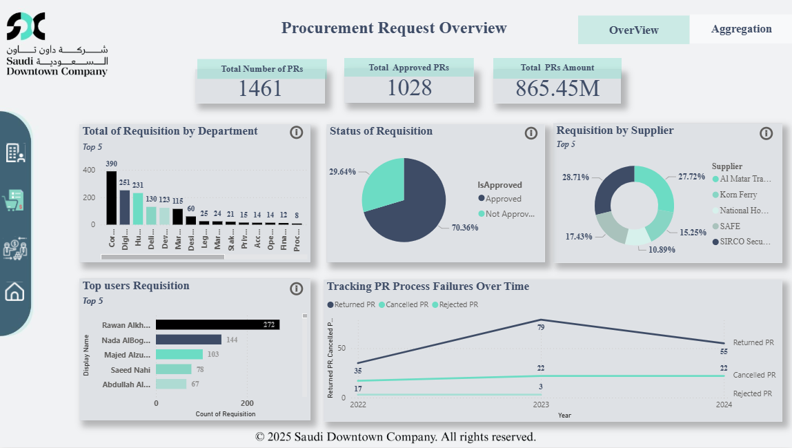

# Saudi Downtown – Procurement Performance Dashboard

## Overview
This project presents a real-world procurement analytics dashboard developed using actual organizational data from Saudi Downtown Company.

The dashboard provides executive-level visibility into procurement operations, financial exposure, approval efficiency, and process failures over time.

---

## Business Objective
To improve procurement transparency by monitoring approval rates, financial impact, supplier dependency, and operational bottlenecks across departments.

---

## Tools & Technologies
- Power BI
- DAX (Calculated Measures & KPIs)
- Data Modeling
- Data Cleaning & Transformation
- Business Performance Analysis

---

## Key Metrics
- Total Procurement Requests
- Total Approved Requests
- Total Procurement Value (SAR)
- Approval Rate (%)
- Returned / Cancelled / Rejected PR Trends
- Top Departments by Volume
- Top Suppliers by Activity

---

## Analytical Approach
- Built structured data model
- Created KPI-driven executive summary
- Designed multi-page interactive reporting
- Implemented time-based trend tracking (2022–2024)
- Performed operational inefficiency analysis

---

## Business Impact
The dashboard enabled leadership to:
- Monitor procurement financial exposure
- Detect process inefficiencies
- Improve approval workflow visibility
- Strengthen supplier accountability

---

## Delivery Timeline
First functional dashboard version delivered within 4 days under structured training timeline.

---
---

## Dashboard Preview

